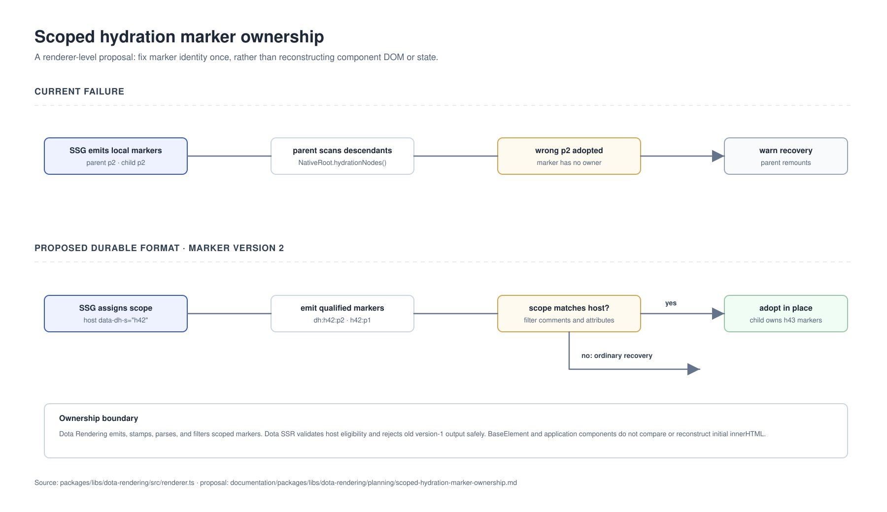

# Scoped hydration marker ownership

Proposal for making Dota Rendering hydrate nested structured components without
confusing their durable markers.

## Problem

The current durable format gives each template local marker names:

```html
<!--dh:p0--><!--/dh:p0-->
<button data-dh-a="p1">
```

During adoption, `NativeRoot.hydrationNodes()` collects every element and comment
below the host. Nested custom elements naturally reuse `p0`, `p1`, and so on.
The parent `TemplateStrategy.adopt()` can therefore bind to a nested component's
comment range or attribute marker. A later value validation fails and the existing
`warn` policy remounts the parent host.

## Ownership contract

Every structured component instance must receive one unique hydration scope at SSG
time. Its host and every durable marker emitted by that instance carry the same
scope.

```html
<blog-view data-dh-s="h42" data-dh-t="…" data-dh-v="2">
  <!--dh:h42:p0--><!--/dh:h42:p0-->
  <md-toc data-dh-s="h43">
    <!--dh:h43:p0--><!--/dh:h43:p0-->
  </md-toc>
</blog-view>
```

Attribute parts use the same qualified token, for example
`data-dh-a="h42:p1 h42:p2"`. A client reads `data-dh-s` from the host and
adopts only markers that match that scope.

## Intended flow

```text
SSG assigns a unique scope to each structured component instance
→ host, child ranges, keyed ranges, and dynamic attributes receive that scope
→ browser upgrades a component
→ renderer reads its host scope and filters durable markers by that scope
→ nested components adopt their own markers independently
```

The root traversal may still see a child custom-element host when the parent owns a
dynamic attribute on it. It must not consume comment boundaries or `data-dh-a`
tokens owned by that child component.



## Implementation boundary

This belongs in `@ayu-sh-kr/dota-rendering`, not `BaseElement` or individual
components. Rendering owns marker emission, host stamping, and marker adoption:

- add a hydration-scope host attribute and scoped marker parser/emitter;
- carry scope through nested `RenderSession` and `RangeRoot` creation;
- filter `TemplateStrategy.adopt()`, child-part collection, keyed ranges, and
  attribute-part lookup by the current scope;
- bump `MARKER_VERSION` from 1 to 2.

`@ayu-sh-kr/dota-ssr` continues to decide whether a component is eligible for
hydration. It must regenerate static output with version 2 and reject version 1
for scoped adoption, falling back to the existing normal render or strict mismatch
behavior. This preserves public render APIs and safely handles stale deployments.

## Verification matrix

- Parent and child templates both have a `p0` child part; both retain server nodes.
- Parent and child have repeated dynamic attribute indexes.
- Parent owns a dynamic attribute on a nested custom-element host.
- Conditional and keyed ranges contain nested custom elements with repeated indexes.
- Version-1 markup warns/remounts (or throws in strict mode) rather than being
  ambiguously adopted.
- A generated blog route retains its `blog-view` node after idle time and produces
  no hydration mismatch warning.

## Related documentation

- [Initial-route bug report](../../../../standards/bugs/dota-hydration-initial-route-bug.md)
- [Initial route hydration roadmap](../../dota-ssr/planning/initial-route-hydration-roadmap.md)
