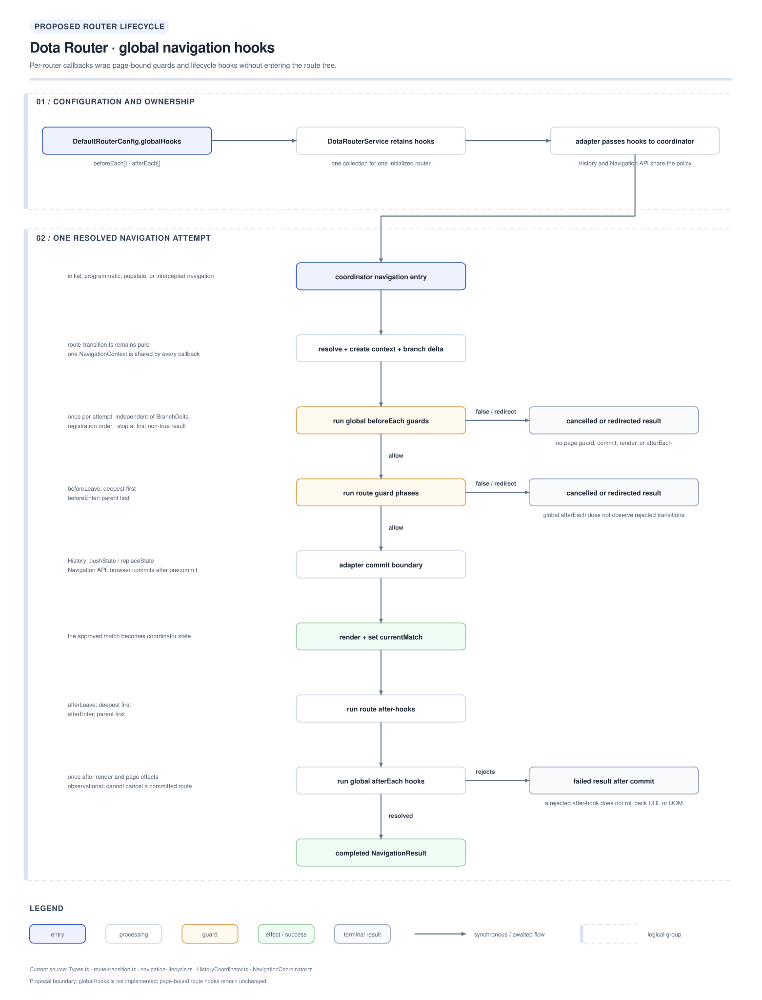

# Global navigation hooks

Global navigation hooks let application-wide policy participate in every router
transition without attaching that policy to a page's `RouteConfig`.

This document is an implementation proposal. The current router only implements
route-bound `beforeEnter`, `beforeLeave`, `afterEnter`, and `afterLeave` callbacks;
the `globalHooks` API described below does not exist yet.



## Context and intent

The requested behavior is best described as **global navigation hooks**, rather
than webhooks. A webhook normally sends an HTTP request to another system. These
callbacks run inside the browser while the router prepares or completes a
navigation.

Today, `RouteConfig` and `@Route` own all navigation callbacks. The coordinators
calculate a `BranchDelta` and invoke callbacks only for route nodes that leave or
enter. That is correct for page cleanup and setup, but it is the wrong ownership
model for concerns that apply to the whole application, such as:

- authentication or tenant checks;
- analytics and page-view publication;
- application-wide diagnostics.

Global hooks should be global to one router instance, not stored in a module-level
singleton. Per-router ownership prevents one application, test, or embedded router
from leaking callbacks into another.

## Proposed public contract

Reuse the existing guard, lifecycle, and context contracts so route-bound and
global callbacks observe the same destination data and cancellation signal:

```ts
export type GlobalNavigationHooks<
  T extends HTMLElement = HTMLElement
> = {
  readonly beforeEach?: readonly RouteGuard<T>[];
  readonly afterEach?: readonly RouteLifecycleHook<T>[];
};
```

Add the optional collection to `DefaultRouterConfig`:

```ts
export interface DefaultRouterConfig<T extends Router<HTMLElement>> {
  // Existing configuration...
  globalHooks?: GlobalNavigationHooks<HTMLElement>;
}
```

The arrays preserve registration order and allow independent application
concerns to be composed without wrapping one callback around another.

A proposed service configuration looks like this:

```ts
const router = DotaRouterService.fromComponents({
  router: DomHistoryRouter,
  routes,
  errorRoute,
  defaultRoute,
  root: AppRoot,
  globalHooks: {
    beforeEach: [
      context => session.canOpen(context.url) || "/sign-in"
    ],
    afterEach: [
      context => analytics.pageView(context.url)
    ]
  }
}).init();
```

`beforeEach` uses `RouteGuardResult`: `true` continues, `false` cancels, and a
string requests a redirect. `afterEach` is observational. It cannot cancel or
redirect a transition that has already committed and rendered.

## Required execution order

Global hooks should wrap the route-specific lifecycle:

| Order | Phase | Scope | Can stop navigation? |
| --- | --- | --- | --- |
| 1 | Resolve route, create `NavigationContext`, calculate `BranchDelta` | Router | No |
| 2 | `globalHooks.beforeEach` | Once per resolved navigation attempt | Yes |
| 3 | Route `beforeLeave` | Leaving branch, deepest first | Yes |
| 4 | Route `beforeEnter` | Entering branch, parent first | Yes |
| 5 | Browser commit boundary | Adapter | No |
| 6 | Render and set `currentMatch` | Coordinator | No |
| 7 | Route `afterLeave` | Leaving branch, deepest first | No |
| 8 | Route `afterEnter` | Entering branch, parent first | No |
| 9 | `globalHooks.afterEach` | Once per completed transition | No |
| 10 | Return `NavigationResult` | Coordinator | No |

This ordering makes global authorization run before page cleanup and makes global
analytics observe the final mounted route after page-level effects have completed.

Global execution must not depend on `BranchDelta`. It therefore still runs when a
navigation resolves to the same route branch, while route callbacks retain their
existing branch-delta behavior. The current Navigation API adapter continues to
ignore hash-only navigation events. Query or parameter changes remain meaningful
transitions under the current `getBranchDelta()` behavior.

## Integration instructions

### 1. Add the public types

Update `src/Types.ts`:

1. Add `GlobalNavigationHooks`.
2. Add `globalHooks?` to `DefaultRouterConfig`.
3. Add an implementation field to `DotaRouterService`; do not expose it on
   `RouterService` unless consumers need to inspect it.
4. Export the type through the existing `export * from "@dota/Types"` entry point.

Do not add global callbacks to `RouteMeta` or `RouteConfig`. Doing so would bind
them to a page again and would make `configure()` copy them into the route tree.

### 2. Add callback runners

Extend `src/coordinator/navigation-lifecycle.ts` with two runners:

```ts
runGlobalGuards(globalHooks.beforeEach ?? [], context)
runGlobalLifecycleHooks(globalHooks.afterEach ?? [], context)
```

The guard runner should execute callbacks sequentially, return the first result
other than `true`, and check `context.signal.aborted` after each allowed result.
The lifecycle runner should await callbacks sequentially in registration order.
Keep the existing route runners because they additionally select a named callback
from each `RouteConfig`.

### 3. Give each coordinator the hook collection

Add an optional, read-only `globalHooks` constructor argument to
`HistoryCoordinator` and `NavigationCoordinator`, defaulting to an empty
collection. Add the same property to the `Coordinator` interface.

`route-transition.ts` should remain a pure transition-data module:

- `createNavigationContext()` creates the one context shared by all callbacks;
- `getBranchDelta()` decides only which route nodes changed;
- global hook execution belongs in the coordinators, outside the branch delta.

No change is required to `PreparedNavigation`: it already retains the approved
match, context, and branch delta between Navigation API precommit and completion.

### 4. Integrate the history coordinator

In `HistoryCoordinator.navigate()`:

1. Resolve the route and create the context as it does now.
2. Run global `beforeEach`.
3. Translate a non-`true` result with `toNavigationResult()` and return before
   route guards, history commit, or rendering.
4. Run the existing route guards.
5. Commit and render as today.
6. Run the existing route after-hooks.
7. Run global `afterEach`.

A thrown global guard follows the existing `failed` result path before commit. A
rejected `afterEach` follows the current after-hook behavior: the result is
`failed`, but history and the rendered route are not rolled back.

### 5. Integrate the Navigation API coordinator

In `NavigationCoordinator.prepare()`, run global `beforeEach` after context and
branch-delta creation and before route guards. Cancellation and redirects then
remain inside `precommitHandler`, so the browser does not commit a rejected
destination.

In `NavigationCoordinator.complete()`, run global `afterEach` after rendering and
route after-hooks. This keeps it strictly post-commit. Direct initial navigation
through `navigate()` uses the same `prepare()` and `complete()` path and therefore
receives the same global behavior.

### 6. Propagate configuration through the adapters and service

Add `globalHooks` as a trailing optional constructor argument after `renderer` in
both browser adapters:

```ts
constructor(
  routes,
  errorRoute,
  defaultRoute,
  root,
  renderer?,
  globalHooks?
)
```

Each adapter passes the collection to its coordinator. The trailing optional
argument preserves existing direct construction calls.

Add the same trailing optional value to the `DotaRouterService` constructor.
`fromComponents()` passes `config.globalHooks` into that constructor, and `init()`
passes it after the renderer to the selected adapter. `RouterConstructor` already
permits trailing construction arguments, but its documentation should name the
new runtime value so custom router implementations know to accept or ignore it.

No changes are needed in `route.decorator.ts` or `route-configurer.ts`; those files
remain responsible only for page-owned configuration.

### 7. Export and document the API

Export the global runner functions from `src/coordinator/index.ts` and `src/main.ts`
only if applications need to compose or test them directly. The normal consumer
API should remain `DotaRouterService.fromComponents({globalHooks})`.

Update the package README with one guard example and one observational hook
example. Call them navigation hooks consistently to avoid implying an HTTP
webhook delivery mechanism.

## Failure and edge-case rules

- The first global or route guard to cancel or redirect stops the remaining guard
  chain.
- A global redirect uses the same relative-URL resolution as a route redirect.
- Aborted asynchronous global guards must not commit or render.
- `afterEach` runs only after a successful render and route after-hooks.
- A rendering failure skips all after-hooks.
- An `afterEach` rejection reports `failed` after commit; it cannot restore the
  previous DOM or browser entry.
- An empty or omitted hook collection must preserve current behavior and add no
  observable callback.
- Hash-only Navigation API events remain browser-managed and do not invoke global
  hooks.
- A module-level registration API should not be added in the first version. If
  runtime registration is needed later, return an unsubscribe function and keep
  the registry on the router instance.

## Verification

Add focused tests before exposing the option:

1. Both coordinators run `beforeEach → beforeLeave → beforeEnter → render →
   afterLeave → afterEnter → afterEach`.
2. Multiple global callbacks preserve registration order.
3. A global cancel skips route hooks, commit, render, and `afterEach`.
4. A global redirect returns the same absolute redirect contract as a route guard.
5. An aborted asynchronous global guard returns `cancelled`.
6. Global hooks run when `BranchDelta` is empty; page hooks do not.
7. A render failure skips `afterEach`.
8. An `afterEach` rejection returns `failed` without undoing the committed match.
9. `DotaRouterService.fromComponents()` forwards hooks through both built-in
   adapters.
10. Omitting `globalHooks` keeps the existing coordinator and adapter tests green.

Run the package gate:

```bash
pnpm --filter @ayu-sh-kr/dota-router test
```

## Files expected to change

| Concern | Source location |
| --- | --- |
| Public global-hook contract and service option | `packages/libs/dota-router/src/Types.ts` |
| Sequential global callback runners | `packages/libs/dota-router/src/coordinator/navigation-lifecycle.ts` |
| Shared coordinator property | `packages/libs/dota-router/src/coordinator/Coordinator.ts` |
| History execution order | `packages/libs/dota-router/src/coordinator/HistoryCoordinator.ts` |
| Navigation API precommit/completion order | `packages/libs/dota-router/src/coordinator/NavigationCoordinator.ts` |
| History adapter propagation | `packages/libs/dota-router/src/router/dom-history.router.ts` |
| Navigation adapter propagation | `packages/libs/dota-router/src/router/dom-navigation.router.ts` |
| Service configuration propagation | `packages/libs/dota-router/src/DotaRouterService.ts` |
| Public exports | `packages/libs/dota-router/src/coordinator/index.ts`, `packages/libs/dota-router/src/main.ts` |
| Behavior and integration tests | `packages/libs/dota-router/test/coordinator/`, `packages/libs/dota-router/test/integration/` |
| Consumer example | `packages/libs/dota-router/README.md` |

## Related documentation

- [Backward-compatible router integration plan](../migration/backward-compatible-router-integration-plan.md)
- [Dota Router improvement roadmap](../planning/improvement-roadmap.md)
- [Dota Router service design](./dota-router-service-hld.svg)
- [Dota Router adapter design](./dota-router-adapters-hld.svg)

## Source references

- [`Types.ts`](../../../../../packages/libs/dota-router/src/Types.ts)
- [`route-transition.ts`](../../../../../packages/libs/dota-router/src/coordinator/route-transition.ts)
- [`navigation-lifecycle.ts`](../../../../../packages/libs/dota-router/src/coordinator/navigation-lifecycle.ts)
- [`HistoryCoordinator.ts`](../../../../../packages/libs/dota-router/src/coordinator/HistoryCoordinator.ts)
- [`NavigationCoordinator.ts`](../../../../../packages/libs/dota-router/src/coordinator/NavigationCoordinator.ts)
- [`DotaRouterService.ts`](../../../../../packages/libs/dota-router/src/DotaRouterService.ts)
