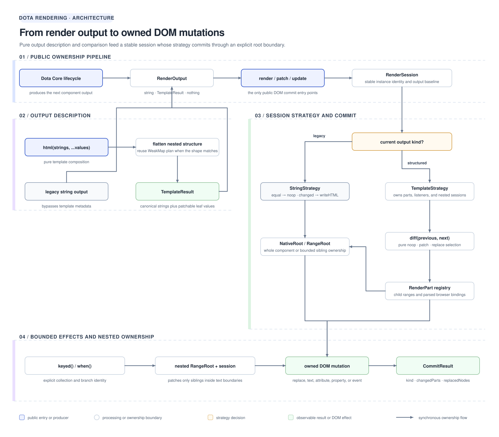
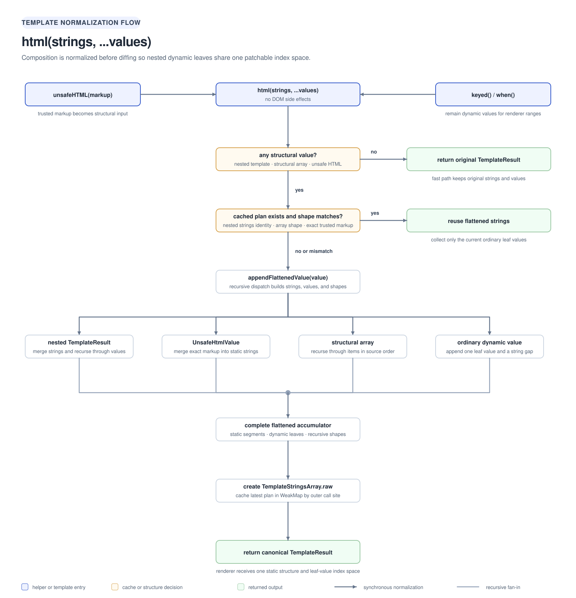
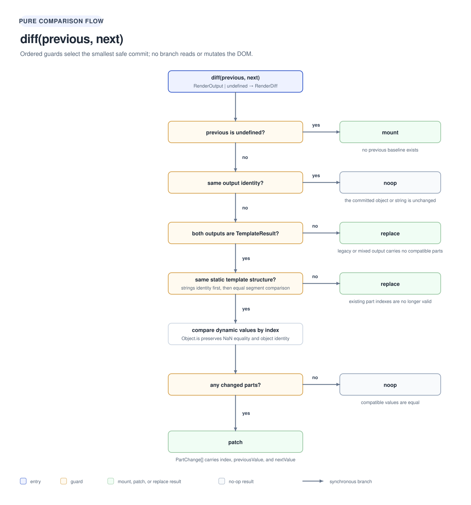
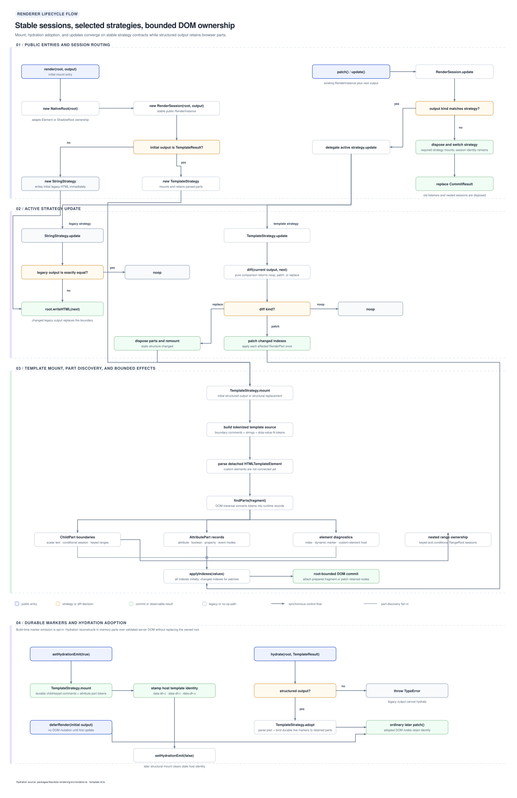

# @ayu-sh-kr/dota-rendering

Rendering primitives for Dota Core.

The package keeps legacy string rendering available while providing structured template
results whose dynamic values can be diffed and patched without replacing unchanged elements.

```ts
import { html, keyed, render, trustedHTML, update, when } from '@ayu-sh-kr/dota-rendering';

const view = render(root, html`<p title="${title}">${message}</p>`);
update(view, html`<p title="${nextTitle}">${nextMessage}</p>`);

const markdownHtml = '<h1>Documentation</h1>';
const markdownView = html`<article>${trustedHTML(markdownHtml)}</article>`;
```

Core owns component lifecycle and scheduling; this package owns render output, part markers,
diffing, and DOM commits.

## Maintainer guide

The implementation is split into three responsibilities:

1. Template creation packages static strings and dynamic values.
2. Diffing compares outputs without touching the DOM.
3. Rendering parses, indexes, and mutates a DOM root.

This lets Dota Core own lifecycle and scheduling while this package owns the render-to-DOM
boundary.

## Architecture diagrams

These source-backed SVGs visualize the current implementation. Select a diagram to open the
full-resolution version under the workspace documentation tree.

### Overall architecture

[](../../../documentation/packages/libs/dota-rendering/architecture/dota-rendering-architecture.svg)

### Template processing

[](../../../documentation/packages/libs/dota-rendering/architecture/template-flow.svg)

### Diff selection

[](../../../documentation/packages/libs/dota-rendering/architecture/diff-flow.svg)

### Renderer lifecycle

[](../../../documentation/packages/libs/dota-rendering/architecture/renderer-flow.svg)

## Architecture model

The renderer is organized as five cooperating layers. Keeping these layers separate is the
main architectural boundary maintainers should preserve.

| Layer | Owned state | Responsibility |
| --- | --- | --- |
| Template helpers | Static strings, dynamic values, flattening plans | Describe render output without touching the DOM. |
| Diffing | Previous and next output | Select `mount`, `noop`, `patch`, or `replace` without causing side effects. |
| Render session | Current strategy and render root | Preserve the public instance while routing legacy and structured output. |
| Render strategy | Last output, parts, nested sessions | Translate a diff decision into browser mutations. |
| Render root | Native root or sibling-range boundary | Limit where a strategy may replace or insert nodes. |

`RenderInstance` is intentionally the only stateful renderer contract exposed to Core. The
concrete session, strategies, roots, and part records remain internal so their implementation
can evolve without changing the Core integration.

## Runtime flow

### Initial structured mount

TemplateStrategy.mount() in src/renderer.ts:

1. Creates an inert HTMLTemplateElement.
2. Joins static template strings with mount-local interpolation tokens.
3. Adds component boundary comments reserved for future SSR and hydration.
4. Traverses the detached template fragment with browser DOM APIs.
5. Assigns document-order indexes and custom-element markers.
6. Converts temporary tokens into in-memory RenderPart records grouped by value index.
7. Applies initial values through direct index lookup while detached, so custom elements cannot
   connect with parser tokens.
8. Attaches the completed fragment to the supplied Element or ShadowRoot.

Temporary interpolation tokens are removed during part discovery and never become committed DOM.
Legacy strings use StringStrategy and assign innerHTML directly. RenderSession keeps the public
instance stable when a client changes between legacy and structured output.

### Subsequent update

~~~text
new output
  -> diff(previous, next)
    -> noop       when nothing changed
    -> patch      when compatible values changed
    -> replace    when structure or output kind changed
  -> renderer commits the selected operation
~~~

For a compatible structured template, diff() returns one PartChange per changed value.
TemplateStrategy.update() uses each index to locate an in-memory RenderPart and writes only its
text node or attribute. It does not query the DOM again or replace unchanged elements.

When static structure changes, the renderer remounts, reparses, reindexes, and replaces the
previous root content. This is the safe fallback because generic whole-tree reconciliation is
not implemented.

## Render sessions and root ownership

### RenderSession

`RenderSession` is the stable identity returned by `render()`. It owns one `RenderRoot` and one
active strategy:

- `StringStrategy` handles legacy `string` and `nothing` output;
- `TemplateStrategy` handles `TemplateResult` output and retained parts.

An update with the same output kind stays within the current strategy. Moving from a string to
a template, or from a template back to a string, disposes the old strategy and creates the new
one while preserving the same public `RenderInstance`. Core therefore does not need separate
storage or migration logic for old and new component render methods.

Sessions form an ownership tree. The top-level session belongs to the component root. A
conditional branch owns a nested session, and every keyed entry owns another nested session.
Disposal cascades through that tree so child ranges do not survive after their owner is
replaced. Calling `dispose()` releases renderer-managed resources but does not
remove the already committed DOM.

### NativeRoot

`NativeRoot` adapts an `Element` or `ShadowRoot`. Structured replacement delegates to
`replaceChildren()`, while legacy output deliberately uses `innerHTML` to preserve the behavior
expected by existing clients. A component should keep one session for its owned native root and
send every later output through `patch()` or `update()`.

### RangeRoot

`RangeRoot` adapts the siblings between two invisible text boundaries. It lets trusted markup,
a conditional branch, or a keyed item mount, patch, replace, and clear only its own section
without replacing the parent element or adjacent children. Legacy strings and `trustedHTML()`
values rendered inside a range are parsed through an inert `HTMLTemplateElement` and inserted
between the boundaries.

Each session owns its own part map and indexing namespace, including sessions nested inside the
same physical DOM tree. Repeated `data-dota-index="0"` values are therefore expected across a
parent template, a conditional branch, keyed entries, or a child component. Index attributes
are diagnostics for a mounted template; they are not node identity. A mount-unique dynamic
marker is used only to recover a bound host when an intermediate light-DOM component clones it.

## DOM marker meanings

Structured mounts add small markers for Core, diagnostics, and future SSR or hydration:

~~~html
<!--dota-component-start-->
<dota-card data-dota-index="0" data-dota-dynamic="dota-render-0-value-element-0" data-dota-component="dota-card">
  Count: 1
</dota-card>
<!--dota-component-end-->
~~~

### data-dota-index

Every rendered element receives a document-order index beginning at 0. The index is valid only
for the current static structure. A structural replacement receives fresh indexes; an index is
not permanent identity across replacements.

Indexes are local to one renderer root. A parent component and child component can both contain
indexes 0, 1, and 2 because their RenderSession instances own separate in-memory maps. The
renderer patches using stored node references and never queries globally by data-dota-index, so
equal numbers in nested components cannot collide.

### data-dota-dynamic

An element receives one marker when one or more interpolations belong to it. Attribute-bearing
elements use a mount-unique marker value; child-text-only elements retain an empty marker. It is
one marker per element, not one marker per interpolation. Normal patches use the element reference
stored in the runtime-only `RenderPart`. If a light-DOM component replaces that element with a
serialized clone, the renderer uses the unique marker once to bind the part to the live host.

### data-dota-component

An element whose local name contains a hyphen is treated as a custom-element candidate and gets
data-dota-component containing its local name. This follows the platform naming convention and
works before customElements.define() has run. A parent renderer marks the custom-element host;
the child component's own renderer handles its internal DOM.

Declarative light-DOM children belong to the parent template that created them. If an intermediate
custom element serializes and recreates those children, mount-unique markers let attribute parts
recover a cloned custom-element host. Recovery updates only that marked host attribute; it does
not inspect or patch the host's component-owned descendants. Dynamic text ranges still require
stable parent-owned nodes, so components that project arbitrary dynamic content should preserve
those nodes or expose a shadow slot.

### Component boundary comments

dota-component-start and dota-component-end comments surround the fragment. They are not dynamic
part markers and are not used by the current patcher. They are reserved for future SSR output
and hydration boundaries.

## Detailed source map

### src/main.ts

The public barrel. It re-exports the contracts, template helpers, diff(), and renderer entry
points. It contains no rendering logic.

### src/types.ts

This module defines the contracts exchanged by template creation, comparison, and DOM commits:

- nothing is the explicit empty-output sentinel;
- RenderOutput is the accepted output union;
- TemplateResult carries static strings and dynamic values;
- UnsafeHtmlValue brands application-owned markup accepted by unsafeHTML();
- TrustedHtmlValue brands caller-approved markup owned by a dynamic child range;
- KeyedValue and KeyedTemplate describe child ranges reconciled by stable RenderKey identity;
- ConditionalValue describes the branch selected by when();
- PartChange reports one changed interpolation;
- RenderDiff selects mount, noop, patch, or replace;
- CommitKind reuses the RenderDiff strategy union;
- CommitResult describes observable DOM work;
- RenderInstance is the stateful handle returned by render().

These contracts intentionally do not expose `RenderSession`, `TemplateStrategy`,
`StringStrategy`, `NativeRoot`, or `RangeRoot`. Core should depend on renderer behavior, not its
implementation classes.

### src/template.ts

This module creates structured results and defines parsing policies:

- html(strings, ...values) packages a TemplateResult without DOM side effects and flattens
  nested TemplateResult values or arrays into one patchable structure. Stable nested shapes
  reuse a cached flattening plan and static strings while collecting only the next leaf values;
- unsafeHTML(value) explicitly merges trusted application-owned HTML or SVG into static
  structure while ordinary strings remain text values;
- trustedHTML(value) parses caller-approved markup inside a local child range and replaces only
  that range when the markup changes;
- keyed(items, getKey, renderItem) retains, inserts, removes, and moves item ranges by stable key;
- when(condition, truthy, falsy) replaces only its local child range when a branch changes;
- valueMarkerFor(index) creates the canonical token available to template-inspection consumers;
- valueMarkerPattern recognizes that canonical token format;
- valueText(value) applies child text conversion and empty-value semantics;
- isAttributePosition(source) checks a source-level attribute position for consumers that need
  it; the current renderer discovers attributes after browser parsing;
- isTemplateResult(value) checks the structured-result kind brand.

Mounted renderer sessions use private token namespaces to avoid collisions with authored text.
If the canonical inspection-token format changes, update valueMarkerFor() and
valueMarkerPattern together.

### src/diff.ts

This module contains pure comparison policy. It does not create nodes, mutate attributes, or
access a render root.

hasSameTemplateStructure() decides whether static strings keep existing part indexes valid.
TemplateStringsArray identity is the fast path; segment comparison supports separately created
but equivalent results.

diff() compares in this order:

1. undefined previous output produces mount;
2. object identity produces noop;
3. non-template combinations produce replace;
4. different static structures produce replace;
5. equal dynamic values are skipped;
6. changed dynamic values produce PartChange records.

This prevents part-level patching when static DOM structure is not compatible.

### src/renderer.ts

This module owns browser interaction:

- ChildPart and AttributePart are runtime-only part records;
- RenderPart is their union;
- NativeRoot and RangeRoot provide whole-root and local-range mutation boundaries;
- StringStrategy implements opaque string replacement;
- TemplateStrategy implements parsed templates and in-place value patches;
- RenderSession preserves public instance identity while changing strategy;
- patch() is the explicit commit entry point;
- update() is the scheduler-oriented alias;
- render() selects and mounts the strategy.

The internal classes are not exported. Core should use render(), patch(), update(), and the
public contracts from types.ts.

#### RenderPart

RenderPart maps dynamic indexes to DOM write operations. ChildPart stores invisible text-node
range boundaries used for text, trusted markup, conditional branches, and keyed lists.
AttributePart stores all indexes used by a quoted HTML attribute, its target, and tokenized
serialized value. The mapping stays in memory rather than becoming verbose DOM metadata.

#### StringStrategy

The legacy strategy. It writes innerHTML on mount and changed updates, while exact-equal output
returns noop. It cannot discover interpolation boundaries because a complete string has already
flattened them.

#### TemplateStrategy

The structured strategy owns the root, last output, and RenderPart map keyed by dynamic value
index. update() selects noop, part patch, or remount. findParts() traverses parsed DOM,
applyIndexes() deduplicates affected parts, and mount() parses and indexes a fresh structure.

#### patch(instance, output)

The explicit commit API for code that already owns a RenderInstance. It delegates to the
instance update policy and returns CommitResult.

#### update(instance, output)

The scheduler-facing alias for the same commit operation. The name lets Core describe an update
without depending on whether the strategy patches or replaces.

#### render(root, output)

The mount entry point. It creates a RenderSession, selects the appropriate strategy, commits the
first output, and returns the stateful instance for later updates.

## Part discovery details

findParts() collects text nodes before replacing them because mutating a TreeWalker traversal
while walking can change what the traversal sees.

For each text node containing temporary tokens, it creates invisible empty Text boundaries for
each dynamic child. ChildPart uses the bounded range for ordinary text, trusted markup, a
conditional branch, or a keyed list. Empty text boundaries do not appear in serialized
innerHTML.

Before parsing, quoted dynamic attributes receive neutral placeholder names so temporary values
cannot reach an observed attribute or its callback. During part discovery, each placeholder
becomes one AttributePart registered under every interpolation index it contains. Any changed
interpolation reconstructs the complete original attribute using all next values.

Structured attributes retain Dota's existing HTML contract:

- Quote assigned values, for example `class="card ${size} theme-${theme}"`.
- Write native boolean attributes by presence, for example `disabled`, without a value.
- Pass component inputs as normal attributes so Dota Core handles `@Property` conversion and
  `attributeChangedCallback`, for example `count="${count}"`.
- Bind events through Dota Core decorators instead of template-specific attribute syntax.

The renderer only reconstructs serialized attribute values with `setAttribute`. It does not
assign DOM properties, reinterpret booleans, or install event listeners.

## Template flattening architecture

Flattening happens in `html()` before diffing or DOM parsing. Its purpose is to turn nested
templates into one canonical sequence of static strings and dynamic leaf values. Without this
step, a nested `TemplateResult` would be an opaque value at one parent interpolation and the
renderer could not patch the nested template's individual attributes or children.

For example, this composition:

~~~ts
const item = (label: string) => html`<li>${label}</li>`;
const view = (labels: string[]) => html`<ul>${labels.map(item)}</ul>`;
~~~

is normalized conceptually into the same shape as one template containing every `<li>` and
every label interpolation. The flattened values share one index space with the parent. This is
an output normalization step only; it does not create DOM, markers, sessions, or keyed identity.

### Flattening fast path

When an `html` call contains only ordinary dynamic values, it returns the original
`TemplateStringsArray` and values without allocating a flattening plan. Ordinary values include
strings, numbers, booleans, objects, keyed directives, conditional directives, trusted HTML
range directives, and arrays that contain no nested template or `unsafeHTML()` value.

An ordinary array is therefore not a retained list. In a normal child position it follows
JavaScript string conversion. Use `keyed()` when each array item needs independent DOM identity.

### Structural values

The following values are recursively flattened:

- a nested `TemplateResult`;
- an array containing a nested template or another structurally flattened array;
- an `unsafeHTML()` directive.

Nested template static segments are merged into the parent segments, while their ordinary leaf
values are appended to the flattened dynamic value list. Trusted markup is also merged into
static structure. Consequently, changing the exact `unsafeHTML()` markup changes template
structure and requires replacement rather than a value patch.

### Flatten-plan cache

JavaScript reuses the `TemplateStringsArray` for repeated evaluations of the same tagged-template
call site. `html()` uses that identity as a key in a `WeakMap` and stores the most recent
`TemplateFlattenPlan` for the call site. The weak key prevents the cache from extending the
lifetime of a call site.

A plan records flattened static strings plus a recursive shape description:

- `value` means one ordinary dynamic leaf;
- `template` records the nested template-string identity and its child shapes;
- `array` records item order, length, and child shapes;
- `unsafe-html` records the exact trusted markup included in static structure.

On the next call, the processor replays current values against this shape. Compatible structure
reuses the same flattened strings and collects only the new dynamic leaves. A different nested
template call site, array length, nested shape, or trusted markup invalidates the plan; `html()`
then rebuilds and replaces that call site's cached plan.

The cache retains only the latest shape for a call site. Alternating between two structural
branches can therefore rebuild the flattening plan each time. For frequently changing branches
use `when()`, and for changing collections use `keyed()`, so structure is owned by local ranges
instead of repeatedly changing the parent template.

### Template compatibility after flattening

`diff()` first uses static-string identity and then falls back to segment equality. If flattened
static strings remain compatible, changed leaf values produce indexed patches and existing
elements are reused. If static segments differ because elements were inserted, removed,
reordered, or nested differently, the result is `replace`; the strategy reparses, reindexes, and
commits a new fragment.

This explicit fallback avoids a general-purpose tree-diff algorithm. Document-order indexes are
valid only for the current mounted structure and are regenerated after replacement.

## Keyed range architecture

`keyed()` is the explicit opt-in for collection identity:

~~~ts
const view = (items: readonly Item[]) => html`
  <ul>
    ${keyed(items, item => item.id, item => html`<li>${item.label}</li>`)}
  </ul>
`;
~~~

The helper creates ordered `KeyedTemplate` entries but does not mutate the DOM. When the value
reaches a `ChildPart`, `TemplateStrategy` reconciles it inside that part's invisible boundaries.
Each key owns:

- an inclusive start/end text range;
- a `RangeRoot` limited to that range;
- a nested `RenderSession` that patches the item's current template.

Reconciliation runs in a deliberate order:

1. Validate every next key before mutation. Duplicate keys throw and leave the existing list
   untouched.
2. Dispose and remove ranges whose keys are absent.
3. Update retained sessions with their next templates.
4. Create boundaries and sessions for new keys.
5. Walk the desired order backwards and move each inclusive range before the current cursor.

Retained keys preserve their element and session identity even when their values update or their
position changes. A retained item's own static-template change replaces only that key's range,
not the parent list.

When the parent supports `moveBefore()`, keyed reordering uses it for a state-preserving
atomic move. The compatibility fallback moves nodes through a `DocumentFragment`; node identity
is retained, but browsers may run disconnect/connect reactions or disturb transient embedded
state. Consumers that depend on atomic lifecycle preservation should account for browser
support.

Keys are scoped to one `keyed()` value and may be strings, numbers, or symbols. They must be
unique among sibling entries and stable across renders. Array position is usually a poor key
when insertion or reordering is possible.

## Conditional range architecture

`when()` uses the same range and nested-session model for one selected branch:

~~~ts
html`<section>${when(isReady, html`<strong>Ready</strong>`)}</section>`
~~~

Changing branches clears or replaces only the child range; the parent element remains mounted.
Repeated renders of the same branch update its nested session normally. Transitioning a child
part between scalar text, conditional output, and keyed output disposes the previous mode before
the next mode takes ownership.

## Trusted structural markup

Use `unsafeHTML()` only for application-authored or sanitized markup. It bypasses normal text
semantics and becomes part of the static template source passed to the browser's `innerHTML`
parser. It does not sanitize, escape, or create a Trusted Types value. Ordinary string
interpolations remain text and are the correct choice for user-controlled data.

## Trusted dynamic markup

Use `trustedHTML()` when approved markup must update without changing the surrounding template:

~~~ts
html`<article>${trustedHTML(markdownHtml)}</article>`
~~~

The renderer parses the value between private text boundaries and replaces only those owned
nodes when the value changes. The `<article>` and its surrounding component DOM retain identity.
Like `unsafeHTML()`, this directive does not sanitize input or create a browser `TrustedHTML`
object; callers must sanitize untrusted content before passing it to the directive.

`trustedHTML()` is valid only in a child position. Passing it to an attribute throws because an
attribute cannot own a parsed sibling range.

### Separating content updates from visual updates

Consumers that render parser-produced documents should retain one `TrustedHtmlValue` until the
document itself changes. Theme, color, selection, and typography updates should patch wrapper
bindings or mutate renderer-owned classes on the existing descendants instead of creating a new
trusted value. This preserves custom elements and browser-managed state inside the document.

`@ayu-sh-kr/dota-md` follows this policy: `md:render` creates the next trusted content range,
while theme and color events update classes in place. A new content event may reconnect nodes
inside the owned range; a visual-theme event does not.

## Architecture decisions

The following decisions describe the current implementation. They are constraints for changes,
not proposals.

| Decision | Reason and consequence |
| --- | --- |
| Preserve legacy string rendering | Existing components can continue returning strings. Equal strings are no-ops; changed strings remain whole-boundary replacements because they contain no part metadata. |
| Keep `RenderInstance` stable | Core retains one handle even when a component migrates between legacy strings and structured templates. `RenderSession` changes its internal strategy instead. |
| Separate pure diffing from DOM commits | `diff()` can be tested and consumed without browser mutation. Strategies remain solely responsible for applying the selected operation. |
| Parse with the browser in a detached template | Browser parsing handles real HTML structure, while neutral placeholder names keep parser tokens away from observed attributes. Part discovery and initial values complete before custom elements connect. |
| Store precise part metadata in memory | Interpolation indexes, node references, attribute templates, and keyed ownership do not pollute serialized DOM. Only compact element-level markers remain. |
| Use one dynamic marker per affected element | `data-dota-dynamic` narrows diagnostics and gives attribute parts a mount-unique fallback when a light-DOM component clones their host. Exact relationships remain in `RenderPart` records. |
| Treat document indexes as local diagnostics | `data-dota-index` describes document order for one mounted template. It is regenerated after remount and is never global identity or the lookup mechanism for patches. |
| Mark custom-element hosts, not rendered internals | Hyphenated hosts receive `data-dota-component`. Content created by their callback or child renderer belongs to a different rendering session; a parent can recover a cloned marked host but never patches that host's internals. |
| Flatten composition before comparison | Nested templates expose one patchable interpolation index space. Shape caching avoids rebuilding stable flattened strings. |
| Require explicit keyed and conditional ranges | Structural collection and branch changes remain local without introducing an implicit whole-tree reconciler. |
| Keep trusted dynamic markup range-local | `trustedHTML()` can replace parser-produced markup without turning a value change into a component remount. Trust and sanitization remain caller responsibilities. |
| Replace incompatible static structure | A remount is safer and deterministic when existing part indexes no longer describe the next template. |
| Apply initial values while detached | Quoted attributes and child values are ready before custom elements connect to the live document. |
| Dispose renderer-owned resources explicitly | Nested sessions are removed before strategy replacement, branch removal, keyed deletion, or public disposal. |
| Keep component boundary comments non-operational | The comments establish a possible SSR/hydration boundary format, but the client patcher does not depend on them yet. |

### Ownership rules for custom elements

A parent structured template owns the custom-element host and any declarative light-DOM children
present in that parent template. Content later produced by the custom element's
`connectedCallback`, child render session, or shadow root belongs to the child. The parent can
recover a serialized clone carrying its mount-unique marker, but does not index or patch the
clone's component-owned descendants. The child renderer starts a new index and part namespace.

This boundary prevents a parent update from accidentally patching child-owned internals. When an
intermediate custom element replaces its light DOM from serialized markup, an attribute part may
recover its marked custom-element host and update that host only. The renderer does not recover
child text boundaries or enter the recovered host's rendered descendants.

For a binding such as `<dota-icon color="${color}">`, ownership flows through three boundaries:

1. The parent renderer calls `setAttribute("color", nextColor)` on the retained `dota-icon` host.
2. The custom-element callback and Dota Core convert that attribute into the icon's `color` property.
3. The icon's own render session updates its internal SVG; the parent renderer never traverses or
   patches that child-owned markup.

The renderer intentionally does not assign the JavaScript property itself. Doing so would bypass
Dota Core's `@Property`, serialization, watcher, and `attributeChangedCallback` contract.

## Compatibility and downstream integration

The package keeps legacy string output as a supported strategy. Existing `html()`, `render()`,
`patch()`, `update()`, `keyed()`, `when()`, `nothing`, and `unsafeHTML()` contracts retain their
behavior; `trustedHTML()` and `TrustedHtmlValue` are additive public APIs.

Structured components require a Dota Core version whose `RenderOutput` and runtime renderer
understand the directives they produce. Packages such as `@ayu-sh-kr/dota-md` must therefore be
released with dependency ranges that resolve a compatible `@ayu-sh-kr/dota-core` and
`@ayu-sh-kr/dota-rendering`. An older renderer treats an unknown directive as an ordinary object
and cannot provide the expected range behavior.

Normal custom-element consumers that use documented attributes and events do not need to change
application code. Consumers that call a component's `render()` directly, require a string return
type, assert exact serialized DOM, or style undocumented internal nodes may observe changes when
a component migrates from legacy strings to `TemplateResult`.

Coordinate releases in dependency order:

1. Publish the rendering version that defines the new directive.
2. Publish Dota Core with a compatible rendering dependency and re-exported contracts.
3. Publish dependent UI libraries against those versions.
4. Validate packed artifacts in an isolated consumer before release.

## Current limitations

- Changed legacy strings are replaced as a whole; only exact equality is optimized.
- Arrays containing templates are flattened and structurally remount when their shape changes;
  ordinary arrays use scalar text conversion, and `keyed()` is required for retained item identity.
- Changed static templates remount instead of using generic tree diffing.
- Hydration and mismatch recovery are represented by boundary markers but not implemented.
- The flatten-plan cache stores only the latest structural shape for each outer call site.
- Atomic keyed moves depend on browser `moveBefore()` support; the fallback preserves node
  identity but may trigger custom-element lifecycle reactions.
- `unsafeHTML()` does not sanitize input or satisfy Trusted Types by itself.
- `trustedHTML()` provides local range ownership but likewise requires trusted or sanitized input.
- Dynamic attributes must use quoted values; native boolean attributes remain static,
  presence-only HTML and events remain owned by Dota Core decorators.

Preserve the distinction between diffing and patching when extending the package: diffing
decides what changed, while a renderer decides which browser operation safely applies it.

## Verification

~~~bash
pnpm --filter @ayu-sh-kr/dota-rendering test
pnpm --filter @ayu-sh-kr/dota-rendering test:coverage
pnpm --filter @ayu-sh-kr/dota-rendering build
~~~

The demonstration test prints mount, diff, patch, update, and element-preservation behavior:

~~~bash
pnpm --filter @ayu-sh-kr/dota-rendering exec vitest run test/renderer-demo.test.ts --reporter=verbose
~~~

## Related documentation and source

- [Template normalization and directives](./src/template.ts)
- [Render sessions, roots, strategies, and parts](./src/renderer.ts)
- [Pure output comparison](./src/diff.ts)
- [Public rendering contracts](./src/types.ts)
- [Dota Core rendering and hydration architecture roadmap](../../../documentation/packages/libs/dota-core/planning/dota-core-rendering-hydration-architecture-roadmap.md)
