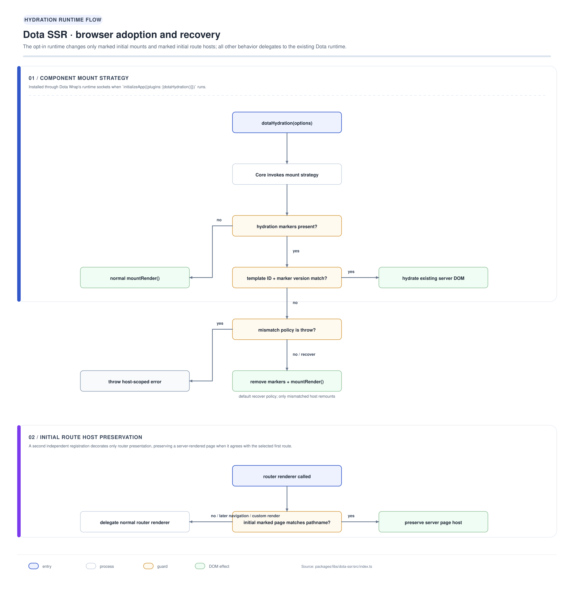
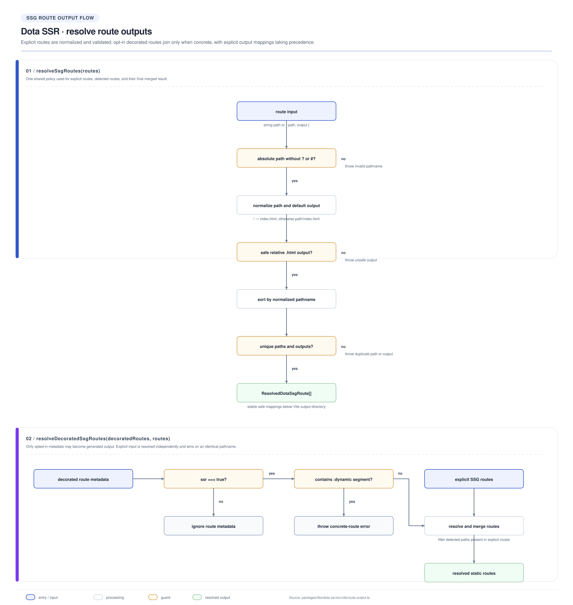

# @ayu-sh-kr/dota-ssr

`@ayu-sh-kr/dota-ssr` adds opt-in static generation and client hydration to Dota
applications. It has two deliberately separate entry points:

- `@ayu-sh-kr/dota-ssr` exports `dotaHydration()` for the browser runtime.
- `@ayu-sh-kr/dota-ssr/vite` exports the build-only `dotaSsg()` Vite plugin.

Without either extension, Dota Core, Rendering, Router, and Wrap retain their
ordinary client-rendered behavior. You can therefore adopt static HTML route by
route rather than changing the rendering model of the whole application.

## Installation

```sh
pnpm add @ayu-sh-kr/dota-ssr
```

The package requires Dota Core, Rendering, Router, and Runtime at runtime. Vite
is an optional peer used only by the `/vite` entry.

## Quick start

Install the hydration plugin in the application entry and the SSG plugin in the
Vite configuration. The application entry must export the promise returned by
`initializeApp()` so the build can wait for registration and startup to finish.

```ts
import {initializeApp} from '@ayu-sh-kr/dota-wrap';
import {dotaHydration} from '@ayu-sh-kr/dota-ssr';

export const applicationReady = initializeApp({
  ...config,
  plugins: [dotaHydration({mismatch: 'warn'})]
});
```

```ts
import dotaSsg from '@ayu-sh-kr/dota-ssr/vite';

export default defineConfig({
  plugins: [dotaSsg({
    entry: '/src/main.ts',
    autoDetectRoutes: true,
    routes: ['/docs/getting-started']
  })]
});
```

## Selecting routes

Mark a concrete page route with `ssr: true` to include it in autodetection.
Routes remain client-only by default. Explicit `routes` can add a route or
override the output file for an automatically discovered route.

```ts
@Route({path: '/blogs', ssr: true})
export class BlogPage extends DotaPageElement {}
```

Dynamic route declarations must be paired with concrete explicit paths. For
example, a blog application can keep the reusable route declaration and expand
known posts during its Vite configuration:

```ts
const blogRoutes = blogPosts.map(post =>
  `/blogs/content/${encodeURIComponent(post.category)}/${encodeURIComponent(post.path)}`
);

export default defineConfig({
  plugins: [dotaSsg({
    autoDetectRoutes: true,
    routes: blogRoutes,
    vercel: true
  })]
});
```

This produces concrete files such as
`blogs/content/tutorial/component-basics/index.html`. At runtime, a page can
read the same pathname with a route helper such as
`resolveBlogRouteParams(pathname, search)` and load the matching Markdown file.
The helper's pathname form is preferred for generated pages; its query-string
fallback keeps older links working.

`dotaSsg()` rejects a discovered route containing a parameter such as
`/blogs/content/:category/:blog` because it cannot know which values to build.
Use explicit routes for the finite set of content entries.

## How prerendering works

After Vite writes the client bundle, the plugin:

1. Reads the built HTML shell.
2. Creates an isolated Happy DOM window for each resolved route.
3. Loads the configured application entry through Vite's module graph.
4. Awaits `applicationReady` (or the export named by `readyExport`).
5. Waits for pending DOM work and tracked `fetch()` calls.
6. Runs `settle()` when application-specific data readiness needs another
   barrier.
7. Serializes the complete document to the route's safe output file.

Each route gets a fresh window and the generated output stays below Vite's
output directory. Duplicate paths, query/hash routes, dynamic autodetected
routes, and output paths that escape the build directory are rejected.

## Data loading during a build

Relative `fetch()` calls first read files from the built output, which makes
assets copied from `public/` available without a web server. If a relative URL
misses those files, set `fetchBaseUrl` to forward it to an API origin. Absolute
cross-origin URLs use Happy DOM's normal fetch behavior.

```ts
export default defineConfig({
  plugins: [dotaSsg({
    routes: ['/community'],
    fetchBaseUrl: 'https://api.example.com',
    settle: async (window, route) => {
      await window.customElements.whenDefined('community-page');
      console.info(`ready to serialize ${route.path}`);
    }
  })]
});
```

The readiness promise should represent application-wide startup. Use `settle`
for a route-specific barrier, such as a component that fetches content after
the application has initialized.

## Hydration and mismatch recovery

The SSG pass emits template identity and part markers. On the first browser
mount, `dotaHydration()` checks those markers before adopting DOM. A matching
structured template is adopted in place, preserving server node identity; later
updates use ordinary Dota Rendering patches. Initial navigation is also adopted
only when the marked page matches the current pathname and uses the default
route renderer.

```ts
initializeApp({
  ...config,
  plugins: [dotaHydration({mismatch: 'throw'})]
});
```

`warn` is the default and remounts only the affected host when identity, marker
version, or part structure does not match. `throw` is useful in development or
CI when deployment skew must fail loudly. Missing markers are treated as an
ordinary client-rendered mount, so static HTML is never adopted accidentally.

### HYDRATED lifecycle event

When a component's server DOM is successfully adopted, `dotaHydration()` tags the returned
`MountResult` with `hydrated: true`. Dota Core reads this flag and emits the `HYDRATED`
lifecycle event — distinct from `CONNECTED` — before the component's normal `CONNECTED` event
fires. Consumers and telemetry can listen for `HYDRATED` to observe "this host was adopted from
server DOM" without inspecting markers:

```ts
import {LifecycleEventConstants} from '@ayu-sh-kr/dota-core';

channel.on(LifecycleEventConstants.HYDRATED, () => {
  // Fires only for hosts that adopted server DOM; never for fresh mounts or mismatch fallbacks.
});
```

Fresh mounts, deferred-ownership mounts, and mismatch-recovery mounts all follow the ordinary
`render()` path, so `CONNECTED` remains the only lifecycle event for those cases.

### Initial route handoff

The browser plugin captures the configured root and its direct route host while
runtime plugins are being composed, before Dota Core upgrades custom elements.
This protects a prerendered page from an empty or shell-only root render. The
handoff is adopted only when the initial transition still has:

- the same connected root and direct route-host relationship;
- the expected route component selector;
- the same normalized pathname; and
- a valid route marker or a legacy template marker.

SSG emits route-level metadata independently of template metadata:

```html
<article-page
  path="/articles/intro"
  data-dh-route="true"
  data-dh-route-version="1">
</article-page>
```

`data-dh-route` establishes route-host ownership, including for string-rendered
pages. `data-dh-t` and `data-dh-v` continue to establish fine-grained template
hydration eligibility. The route marker does not make string content patchable;
the page enters ordinary rendering on its first update.

A page with no `data-dh-route` is still accepted as a **legacy** route host, but
only when its `data-dh-v` equals the fixed sentinel `LEGACY_ROUTE_TEMPLATE_VERSION`
(currently `2`) — the last template version emitted before route markers existed.
That sentinel does not track `MARKER_VERSION` as it changes in future releases, so
a page emitted under a later template version with no route marker is no longer
silently adopted; it's captured, fails adoption, and is reported through `mismatch`
like any other route-marker mismatch above. This closes what would otherwise be an
open-ended legacy fallback.

The handoff is one-time. Initial mismatches, custom route renderers, redirects,
and later navigations release it and call the normal router renderer. This keeps
stale static DOM from suppressing a legitimate route transition.

A captured route that fails to match the initial client route (wrong path, missing
marker, mismatched component) is now reported through the same `mismatch` policy
passed to `dotaHydration()` — `warn` logs it and falls through to the router
renderer; `throw` surfaces it as a rejected navigation. A route intentionally using
a custom `render` callback is never reported this way, since that's a deliberate
bypass rather than a mismatch.

`setHydrationMismatchPolicy` (from `@ayu-sh-kr/dota-rendering`) is deprecated on
this path: `dotaHydration()` always calls `hydrate()` with its own resolved
`mismatch` option, so the module-level default has no effect here. It only still
matters for code calling `dota-rendering`'s `hydrate()` directly, outside of this
plugin.

## Deployment redirects

Set `vercel: true` to add redirects from generated route paths to their static
documents in the nearest `vercel.json`. Existing Vercel configuration is
preserved. If discovery cannot find the intended file, use
`vercel: {configFile: '../vercel.json'}`.

## Public API

| Entry point | Main exports | Use |
| --- | --- | --- |
| `@ayu-sh-kr/dota-ssr` | `dotaHydration`, `DotaHydrationOptions`, route-marker constants | Browser-side adoption of compatible static markup and initial route hosts. |
| `@ayu-sh-kr/dota-ssr/vite` | `dotaSsg`, route types and route resolvers | Build-time route rendering and output mapping. |

The package is opt-in by design: adding it as a dependency does not change
rendering until one of these functions is installed.

## Architecture diagrams

[](../../../documentation/packages/libs/dota-ssr/architecture/hydration-runtime-flow.svg)

[](../../../documentation/packages/libs/dota-ssr/architecture/route-output-flow.svg)

Related package flows:

- [Rendering lifecycle](../../../documentation/packages/libs/dota-rendering/architecture/renderer-flow.svg)
- [Dota Wrap startup](../../../documentation/packages/libs/dota-wrap/architecture/dota-wrap-hld.svg)
